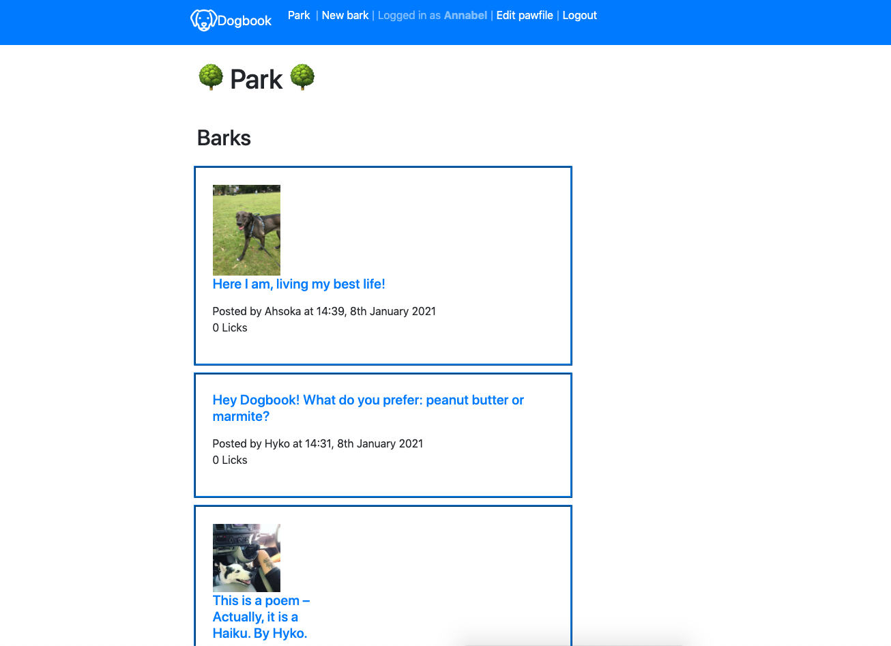
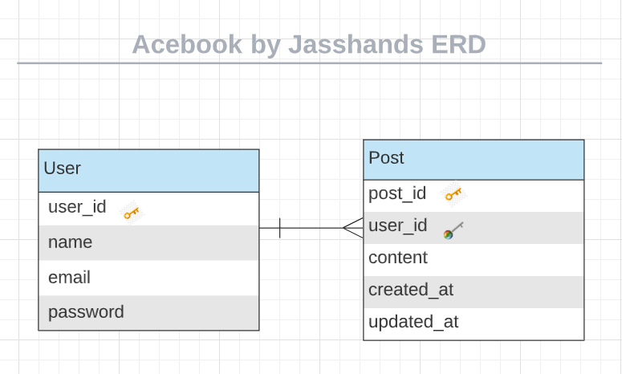

# Dogbook by Jasshands!

Makers Academy weeks 8 and 9 engineering project. The [original project outline is here](https://github.com/makersacademy/course/tree/master/engineering_projects/rails).

Card wall [is on Trello here](https://trello.com/b/56RoJ3Aw/acebook-jasshands).

<!-- ## Project process
[CONTRIBUTING.md](CONTRIBUTING.md) -->

## View our project on [Heroku](https://stark-badlands-89046.herokuapp.com/).

The homepage looks like this


## User stories

```
As a user,
So I can access Dogbook,
I need to sign up with my email and password.

As a user,
So I can use Dogbook,
I want to sign in to my account.

As a user,
So I can share stuff,
I want to create posts.

As a user,
So I know who posted something,
I can see which user posted it.

As a user,
So I can see when something was posted,
I can see the date it was posted.

As a user,
If I'm embarrassed about a previous post,
I can update one of my posts.

As a user,
If I really don't like an old post,
I can delete one of my posts.

As a user,
So I can see the latest content,
Posts appear in order, with the newest first.

As a user,
So I can post my poetry,
Posts let me have line breaks where I want them.

As a user,
So I can engage with others,
I can comment on posts.

As a user,
So I can see who is commenting,
I can see who is making comments.

```


## Resources

Here are some of the materials we found helpful:

- For [authentication](https://levelup.gitconnected.com/simple-authentication-guide-with-ruby-on-rails-16a6255f0be8)
- For [logging out](https://moustafamm.medium.com/authentication-in-rails-sign-up-log-in-and-log-out-8042b35b4325)

## Diagrams





## Tools used
- Lucidcharts
- Balsamiq
